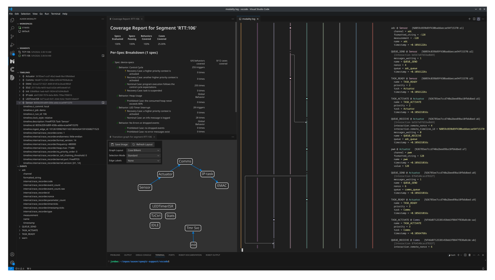

# modality-trace-recorder-plugin

A [Modality][modality] reflector plugin suite and ingest adapter library for Percepio's [TraceRecorder][trace-recorder] data.



| Kernel Port | Streaming Protocol | File Import | Stream Ports |
| :---:       | :---:              | :---:       | :---:           |
| FreeRTOS    | v10, v12-v14       | yes         | TCP, ITM, RTT   |

## Getting Started

1. Add [TraceRecorder][trace-recorder] source files and configuration into your RTOS project (e.g. using [Using FreeRTOS-Plus-Trace](https://www.freertos.org/FreeRTOS-Plus/FreeRTOS_Plus_Trace/RTOS_Trace_Instructions.html))
2. Use the importer to import a memory dump or streaming data file, or use one of the available streaming collectors to collect data from a running system

## Adapter Concept Mapping

The following describes the default mapping between [TraceRecorder's][trace-recorder] concepts
and [Modality's][modality] concepts. See the configuration section for ways to change the
default behavior.

* Task and ISR objects are represented as separate Modality timelines
* The initial startup task ('(startup)') is also represented as a separate Modality timeline
* Streaming header fields are represented as Modality timeline attributes under the `timeline.internal.trace_recorder` prefix
* Object properties and event context fields are represented as Modality event attributes under the `event.internal.trace_recorder` prefix
* Event field attributes are at the root level (e.g. `event.channel` for `USER_EVENT` channel field)
* Task and ISR context switches will be synthesized into Modality timeline interactions

See the [Modality documentation](https://docs.auxon.io/modality/) for more information on the Modality concepts.

### Event Counter and Timestamps

Raw event count and timestamp timer ticks are provided alongside the rollover-tracked values.
If the trace-recorder-provided timestamp information message contains the frequency, we additionally
convert timestamp ticks to nanoseconds.

* Raw timestamp timer ticks are available on the `event.internal.trace_recorder.timer.ticks` attribute
* Rollover tracking timestamp ticks are available on the `event.internal.trace_recorder.timestamp.ticks` attribute
* Raw event count is available on the `event.internal.trace_recorder.event_count.raw` attribute
* Rollover tracking event count is available on the `event.internal.trace_recorder.event_count` attribute
* When we detect dropped events, the event attribute `event.trace_recorder.dropped_preceding_events` is added to the current event
  and a warning message is logged.

### Unknown Events

Note that we don't support the entirety of the trace-recorder event model.
When we encounter an event type that is not supported, we log a debug message and ignore it but it's not considered dropped (e.g. we still use it to update the event counter tracking).

To see the debug messages set the `RUST_LOG` environment variable before running the reflector:
```bash
RUST_LOG=modality_trace_recorder=debug
modality-reflector run --config reflector-config.toml --collector trace-recorder-rtt
```

The output will look like the following:
```text
2024-05-06T13:52:45.270020Z DEBUG modality_trace_recorder_plugin::trc_reader: Skipping unknown event_type=TASK_DELAY timestamp=2829820537 id=7A event_count=31002
```

To include unknown events set `include-unknown-events = true` in the configuration file (or `--include-unknown-events` at the CLI).

```bash
modality query '*@* (_.name = "*FAILED" OR _.name = "TASK_DELAY_UNTIL")' --show-internal
```

```text
Result 1:
═════════
■             QUEUE_RECEIVE_FAILED @ (startup)   [%bb222bbc6f434e1b85f8471dea241152:ad]
║               internal.trace_recorder.code = 12387
║               internal.trace_recorder.event_count = 205
║               internal.trace_recorder.event_count.raw = 205
║               internal.trace_recorder.id = 99
║               internal.trace_recorder.parameter_count = 3
║               internal.trace_recorder.timer.ticks = 447344223
║               internal.trace_recorder.timestamp.ticks = 447344223
║               internal.trace_recorder.type = QUEUE_RECEIVE_FAILED
║               name = QUEUE_RECEIVE_FAILED
║               timestamp = +2.6840653s
║

Result 2:
═════════
■             TASK_DELAY_UNTIL @ (startup)   [%bb222bbc6f434e1b85f8471dea241152:6e]
║               internal.trace_recorder.code = 4217
║               internal.trace_recorder.event_count = 138
║               internal.trace_recorder.event_count.raw = 138
║               internal.trace_recorder.id = 121
║               internal.trace_recorder.parameter_count = 1
║               internal.trace_recorder.timer.ticks = 445620413
║               internal.trace_recorder.timestamp.ticks = 445620413
║               internal.trace_recorder.type = TASK_DELAY_UNTIL
║               name = TASK_DELAY_UNTIL
║               timestamp = +2.9737225s
║
```

### Warnings Channel

Trace recorder uses an internal reserved `USER_EVENT` channel named `#WFR` for internal errors and warnings.
When we encounter these events, a warning message is logged to the console in addition to being recorded.
They are automatically mapped to the Modality event name `WARNING_FROM_RECORDER`.

```
$ modality query 'WARNING_FROM_RECORDER@*'
Result 1:
═════════
■             WARNING_FROM_RECORDER @ TzCtrl   [%1548e96bf8f74a03970e049bd53598ce:44]
║               channel = #WFR
║               formatted_string = No slots left in Stack Monitor
║               name = WARNING_FROM_RECORDER
║               timestamp = +2.674739s

Result 2:
═════════
■             WARNING_FROM_RECORDER @ (startup)   [%ceedb01a2e184a8d9e725cdc7bf3b424:62]
║               channel = #WFR
║               formatted_string = Exceeded TRC_CFG_ENTRY_TABLE_SLOTS
║               name = WARNING_FROM_RECORDER
║               timestamp = +2.684145s
```

### Interaction Modes

The plugins can be configured for different interaction modes via the `interaction-mode` field (or `--interaction-mode` at the CLI).

Available modes:
* `fully-linearized`: An interaction is produced on every context switch event from the preceding task/ISR context to the
  active task/ISR context. This effectively linearizes the system execution where everything is causally connected.
* `ipc`: An interaction is produced for each task/ISR IPC.
   Currently this supports the following object kinds:
  - queue
  - task notification

### Target Resources

Target CPU utilization related information is recorded whenever a context switch event occurs.
The default measurement interval is 500 ms and can be changed via the configuration field `cpu-utilization-measurement-window`.

The following event attributes are added:
* `event.cpu_utilization` : `event.runtime_in_window / event.runtime_window`
* `event.runtime` : Total accumulated time this context has been in the running state
* `event.total_runtime` : Total system accumulated run time
* `event.runtime_in_window` : Time this context has been in the running state during `event.runtime_window`
* `event.runtime_window` : Duration of the CPU utilization measurement window

```text
$ modality query '* @ * (exists(_.cpu_utilization))'

Result 1:
═════════
■             TASK_ACTIVATE @ Sensor   [%d55261a81d1643068e04f887c08ff0fe:4646]
║               cpu_utilization = 5.089227485985114e-1
║               name = TASK_ACTIVATE
║               priority = 2
║               runtime = +0.36644152s
║               runtime_in_window = +0.25446948s
║               runtime_window = +0.500016s
║               task = Sensor
║               timestamp = +10.02834s
║               total_runtime = +10.02834s

Result 2:
═════════
■             TASK_ACTIVATE @ Actuator   [%d8626207906d4123a5da989a8e2ca1fa:53]
║               cpu_utilization = 4.999068145030632e-1
║               name = TASK_ACTIVATE
║               priority = 2
║               runtime = +0.92361575s
║               runtime_in_window = +0.24996251s
║               runtime_window = +0.5000182s
║               task = Actuator
║               timestamp = +11.133847s
║               total_runtime = +11.133847s
```

If the trace-recorder configuration `TRC_CFG_ENABLE_STACK_MONITOR` is set, then unused stack (low mark) is
reported on the `UNUSED_STACK` event.

```text
$ modality query 'UNUSED_STACK@*'

Result 1:
═════════
■             UNUSED_STACK @ TzCtrl   [%f1489d27ae7b40c78877426df2219299:57]
║               low_mark = 1004
║               task = TzCtrl
║               timestamp = +0.00177055s
║

Result 2:
═════════
■             UNUSED_STACK @ TzCtrl   [%f1489d27ae7b40c78877426df2219299:58]
║               low_mark = 1173
║               task = IP-task
║               timestamp = +0.00197885s
```

## Configuration

All of the plugins can be configured through a TOML configuration file (from either the `--config` option or the `MODALITY_REFLECTOR_CONFIG` environment variable).
All of the configuration fields can optionally be overridden at the CLI, see `--help` for more details.

See the [`modality-reflector` Configuration File documentation](https://docs.auxon.io/modality/ingest/modality-reflector-configuration-file.html) for more information
about the reflector configuration.

### Common Sections

These sections are the same for each of the plugins.

* `[ingest]` — Top-level ingest configuration.
  - `additional-timeline-attributes` — Array of key-value attribute pairs to add to every timeline seen by the plugin.
  - `override-timeline-attributes` — Array of key-value attribute pairs to override on every timeline seen by this plugin.
  - `allow-insecure-tls` — Whether to allow insecure connections. Defaults to `false`.
  - `protocol-parent-url` — URL to which this reflector will send its collected data.

* `[metadata]` — Plugin configuration table.
  - `run-id` — Use the provided UUID as the run ID instead of generating a random one.
  - `time-domain` — Use the provided UUID as the time domain ID instead of generating a random one.
  - `interaction-mode` — Interaction mode to use (`fully-linearized` or `ipc`). The default value is `fully-linearized`.
  - `startup-task-name` — Use the provided initial startup task name instead of the default (`(startup)`).
  - `cpu-utilization-measurement-window` — CPU utilization measurement window minimum duration (Default is 500ms).
  - `single-task-timeline` — Use a single timeline for all tasks instead of a timeline per task. ISRs can still be represented with their own timelines or not.
  - `disable-task-interactions` — Don't synthesize interactions between tasks and ISRs when a context switch occurs.
  - `use-timeline-id-channel` — Detect task/ISR timeline IDs from the device by reading events on the `modality_timeline_id` channel (format is `name=<obj-name>,id=<timeline-id>`).
  - `deviant-event-id-base` — Parse Deviant custom events using the provided base event ID.
  - `custom-printf-event-id` — Parse custom printf events using the provided event ID. See the [reference implementation](https://github.com/auxoncorp/trace-recorder-parser/blob/master/test_resources/src/streaming/v14/custom_printf_event.c) for the event layout.
  - `include-unknown-events` — Include unknown events instead of ignoring them.
  - `ignored-object-classes` — Array of object classes to ignore processing during ingest (e.g. `[queue, semaphore]`)
  - `user-event-channel` — Instead of `USER_EVENT @ <task-name>`, use the user event channel as the event name (`<channel> @ <task-name>`).
  - `user-event-format-string` — Instead of `USER_EVENT @ <task-name>`, use the user event format string as the event name (`<format-string> @ <task-name>`).
  - `user-event-format-string-channels` — Same as `user-event-format-string` but for a specific set of channels.
  - `[[user-event-channel-name]]` — Use a custom event name whenever a user event with a matching channel is processed.
    * `channel`— The input channel name to match on.
    * `event-name`— The Modality event name to use.
  - `[[user-event-formatted-string-name]]` — Use a custom event name whenever a user event with a matching formatted string is processed.
    * `formatted-string`— The input formatted string to match on.
    * `event-name`— The Modality event name to use.
  - `[[user-event-fmt-arg-attr-keys]]` — Use custom attribute keys instead of the default `argN` keys for user events matching the given channel and format string.
    * `channel`— The input channel name to match on.
    * `format-string`— The input format string to match on.
    * `attribute-keys`— Array of Modality event attribute keys to use.

#### Deviant Events

When the `deviant-event-id-base` configuration is provided, Deviant related information will be parsed and mapped
from TraceRecorder custom events to their reserved Modality event names and attributes.

Expected event ID offset and data:
* Event: `modality.mutator.announced`
  - Event ID offset: 0
  - data: `['mutator_id']`
    - `mutator_id` is a 16-byte UUID array
* Event: `modality.mutator.retired`
  - Event ID offset: 1
  - data: `['mutator_id']`
    - `mutator_id` is a 16-byte UUID array
* Event: `modality.mutation.command_communicated`
  - Event ID offset: 2
  - data: `['mutator_id', 'mutation_id', 'mutation_success']`
    - `mutator_id` is a 16-byte UUID array
    - `mutation_id` is a 16-byte UUID array
    - `mutation_success` is a 4-byte (`uint32_t`) boolean
* Event: `modality.mutation.clear_communicated`
  - Event ID offset: 3
  - data: `['mutator_id', 'mutation_id', 'mutation_success']`
    - `mutator_id` is a 16-byte UUID array
    - `mutation_id` is a 16-byte UUID array
    - `mutation_success` is a 4-byte (`uint32_t`) boolean
* Event: `modality.mutation.triggered`
  - Event ID offset: 4
  - data: `['mutator_id', 'mutation_id', 'mutation_success']`
    - `mutator_id` is a 16-byte UUID array
    - `mutation_id` is a 16-byte UUID array
    - `mutation_success` is a 4-byte (`uint32_t`) boolean
* Event: `modality.mutation.injected`
  - Event ID offset: 5
  - data: `['mutator_id', 'mutation_id', 'mutation_success']`
    - `mutator_id` is a 16-byte UUID array
    - `mutation_id` is a 16-byte UUID array
    - `mutation_success` is a 4-byte (`uint32_t`) boolean

See the [Deviant documentation](https://docs.auxon.io/deviant/) for more information on Mutators and Mutations.

### Importer Section

These `metadata` fields are specific to the importer plugin.

Note that individual plugin configuration goes in a specific table in your
reflector configuration file, e.g. `[plugins.ingest.importers.trace-recorder.metadata]`.

* `[metadata]` — Plugin configuration table.
  - `file` — Path to the file to import.

### TCP Collector Section

These `metadata` fields are specific to the streaming TCP collector plugin.

Note that individual plugin configuration goes in a specific table in your
reflector configuration file, e.g. `[plugins.ingest.collectors.trace-recorder-tcp.metadata]`.

* `[metadata]` — Plugin configuration table.
  - `disable-control-plane` — Disable sending control plane commands to the target. By default, `CMD_SET_ACTIVE` is sent on startup and shutdown to start and stop tracing on the target.
  - `restart` — Send a stop command before a start command to reset tracing on the target.
  - `connect-timeout` — Specify a connection timeout. Accepts durations like "10ms" or "1minute 2seconds 22ms".
  - `remote` — The remote TCP server URL or `address:port` to connect to. The default is `127.0.0.1:8888`.

### ITM Collector Section

These `metadata` fields are specific to the streaming ITM collector plugin.

Note that individual plugin configuration goes in a specific table in your
reflector configuration file, e.g. `[plugins.ingest.collectors.trace-recorder-itm.metadata]`.

* `[metadata]` — Plugin configuration table.
  - `disable-control-plane` — Disable sending control plane commands to the target. By default, `CMD_SET_ACTIVE` is sent on startup and shutdown to start and stop tracing on the target.
  - `restart` — Send a stop command before a start command to reset tracing on the target.
  - `elf-file` — Extract the location in memory of the ITM streaming port variables from the debug symbols from an ELF file (`tz_host_command_bytes_to_read` and `tz_host_command_data`).
    These are used to start and stop tracing by writing control plane commands from the probe.
  - `command-data-addr` —  Use the provided memory address for the ITM streaming port variable `tz_host_command_data`.
    These are used to start and stop tracing by writing control plane commands from the probe.
  - `command-len-addr` — Use the provided memory address for the ITM streaming port variable `tz_host_command_bytes_to_read`.
    These are used to start and stop tracing by writing control plane commands from the probe.
  - `stimulus-port` — The ITM stimulus port used for trace recorder data. The default value is 1.
  - `probe-selector` — Select a specific probe instead of opening the first available one.
  - `chip` — The target chip to attach to (e.g. `STM32F407VE`).
  - `protocol` — Protocol used to connect to chip. Possible options: [`swd`, `jtag`]. The default value is `swd`.
  - `speed` — The protocol speed in kHz. The default value is 4000.
  - `core` — The selected core to target. The default value is 0.
  - `clk` — The speed of the clock feeding the TPIU/SWO module in Hz.
  - `baud` — The desired baud rate of the SWO output.
  - `reset` — Reset the target on startup.
  - `chip-description-path` — Provides custom target descriptions based on CMSIS Pack files.
    See the [probe-rs target extraction](https://probe.rs/docs/knowledge-base/cmsis-packs/#target-extraction) section for
    more information.

### RTT Collector Section

These `metadata` fields are specific to the streaming RTT collector plugin.

Note that individual plugin configuration goes in a specific table in your
reflector configuration file, e.g. `[plugins.ingest.collectors.trace-recorder-rtt.metadata]`.

* `[metadata]` — Plugin configuration table.
  - `attach-timeout` — Specify a target attach timeout.
    When provided, the plugin will continually attempt to attach and search for a valid
    RTT control block anywhere in the target RAM.
    Accepts durations like "10ms" or "1minute 2seconds 22ms".
    See the [RTT timing section](https://docs.rs/probe-rs-rtt/0.14.2/probe_rs_rtt/struct.Rtt.html#examples-of-how-timing-between-host-and-target-effects-the-results) for more information.
  - `disable-control-plane` — Disable sending control plane commands to the target.
    By default, `CMD_SET_ACTIVE` is sent on startup and shutdown to start and stop tracing on the target.
  - `restart` — Send a stop command before a start command to reset tracing on the target.
  - `up-channel` — The RTT up (target to host) channel number to poll on. The default value is 1.
  - `down-channel` — The RTT down (host to target) channel number to send start/stop commands on. The default value is 1.
  - `probe-selector` — Select a specific probe instead of opening the first available one.
  - `chip` — The target chip to attach to (e.g. `STM32F407VE`).
  - `protocol` — Protocol used to connect to chip. Possible options: [`swd`, `jtag`]. The default value is `swd`.
  - `speed` — The protocol speed in kHz. The default value is 4000.
  - `core` — The selected core to target. The default value is 0.
  - `reset` — Reset the target on startup.
  - `attach-under-reset` — Attach to the chip under hard-reset.
    This asserts the reset pin via the probe, plays the protocol init routines and deasserts the pin.
  - `chip-description-path` — Provides custom target descriptions based on CMSIS Pack files.
    See the [probe-rs target extraction](https://probe.rs/docs/knowledge-base/cmsis-packs/#target-extraction) section for
    more information.
  - `control-block-address` — Use the provided RTT control block address instead of scanning the target memory for it.
  - `elf-file` — Extract the location in memory of the RTT control block debug symbol from an ELF file.
  - `thumb` — Assume thumb mode when resolving symbols from the ELF file for breakpoint addresses.
  - `setup-on-breakpoint` — Set a breakpoint on the address of the given symbol used to signal
    when to optionally configure the channel mode and start reading.
  - `rtt-poll-interval` — The host-side RTT polling interval. The default value is 1ms.
    Accepts durations like "10ms" or "1minute 2seconds 22ms".
  - `rtt-read-buffer-size` — Size of the host-side RTT buffer used to store data read off the target.
    The default value is 1024.
  - `metrics` — Periodically log RTT metrics to stdout that can be used to assess the target and host RTT configuration.

### Configuration Examples

The configuration example snippets below are based on the importer section
but can also be applied to any of the collectors.

Each example builds on the previous.

The data was queried using [modality query](https://docs.auxon.io/modality/query.html) and was produced from the following
[TraceRecorder][trace-recorder] instrumentation (truncated for brevity).

```c
// logging_info will write to a channel named "info"
#define INFO(fmt, ...) logging_info(fmt, ##__VA_ARGS__)

int main(void)
{
    // ...

    INFO("System initialized");

    // ...
}

static void sensor_task(void* params)
{
    int16_t adc;
    traceString ch;

    ch = xTraceRegisterString("adc");
    while(1)
    {
        // ...
        adc = read_adc();
        vTracePrintF(ch, "%d", adc);
        // ...
    }
}

static void comms_task(void* params)
{
    traceString ch;
    wire_msg_s wire_msg = {0};

    ch = xTraceRegisterString("comms-tx");

    // ...

    INFO("Comms network ready");

    while(1)
    {
        const comms_msg_s comms_msg = comms_recv();

        // ...

        wire_msg.magic0 = WIRE_MAGIC0;
        wire_msg.magic1 = WIRE_MAGIC1;
        wire_msg.type = WIRE_TYPE_SENSOR_DATA;
        wire_msg.seqnum += 1;
        wire_msg.adc = comms_msg.adc;

        vTracePrintF(ch, "%u %u %d", wire_msg.type, wire_msg.seqnum, wire_msg.adc);

        // ...
    }
}
```

#### Default

```
■  ║  ║  TRACE_START @ (startup)  [1272bab3d50d491691d0abefd1bc9cc0:00]
║  ║  ║    task=(startup)
║  ║  ║    timestamp=1190400ns
║  ║  ║
■  ║  ║  USER_EVENT @ (startup)  [1272bab3d50d491691d0abefd1bc9cc0:13]
║  ║  ║    channel=info
║  ║  ║    formatted_string=System initialized
║  ║  ║    timestamp=7027200ns
║  ║  ║
║  ■  ║  USER_EVENT @ Sensor  [5528cf640e1045ea833335b809cfc02e:0130]
║  ║  ║    arg0=-128
║  ║  ║    channel=adc
║  ║  ║    formatted_string=-128
║  ║  ║    timestamp=262105600ns
║  ║  ║
║  ║  ■  USER_EVENT @ Comms  [8a0430ddb8c143299c01080926457436:04d6]
║  ║  ║    channel=info
║  ║  ║    formatted_string=Comms network ready
║  ║  ║    timestamp=2173248000ns
║  ║  ║
║  ║  ■  USER_EVENT @ Comms  [8a0430ddb8c143299c01080926457436:04d8]
║  ║  ║    arg0=240
║  ║  ║    arg1=1
║  ║  ║    arg2=-128
║  ║  ║    channel=comms-tx
║  ║  ║    formatted_string=240 1 -128
║  ║  ║    timestamp=2173299200ns
```

#### startup-task-name

```toml
[plugins.ingest.importers.trace-recorder.metadata]
startup-task-name = 'my-fw-img'
```

```
■  ║  ║  TRACE_START @ my-fw-img  [a324dcfaddb6415b878741b0238f4cf3:00]
║  ║  ║    task=(startup)
║  ║  ║    timestamp=1190400ns
║  ║  ║
■  ║  ║  USER_EVENT @ my-fw-img  [a324dcfaddb6415b878741b0238f4cf3:13]
║  ║  ║    channel=info
║  ║  ║    formatted_string=System initialized
║  ║  ║    timestamp=7027200ns
║  ║  ║
║  ■  ║  USER_EVENT @ Sensor  [8e1c7e7a3560498d932247bb100281f2:0130]
║  ║  ║    arg0=-128
║  ║  ║    channel=adc
║  ║  ║    formatted_string=-128
║  ║  ║    timestamp=262105600ns
║  ║  ║
║  ║  ■  USER_EVENT @ Comms  [ffe10d39ee5546e8aa0fc0450ee37ed0:04d6]
║  ║  ║    channel=info
║  ║  ║    formatted_string=Comms network ready
║  ║  ║    timestamp=2173248000ns
║  ║  ║
║  ║  ■  USER_EVENT @ Comms  [ffe10d39ee5546e8aa0fc0450ee37ed0:04d8]
║  ║  ║    arg0=240
║  ║  ║    arg1=1
║  ║  ║    arg2=-128
║  ║  ║    channel=comms-tx
║  ║  ║    formatted_string=240 1 -128
║  ║  ║    timestamp=2173299200ns
```

#### user-event-channel

```toml
[plugins.ingest.importers.trace-recorder.metadata]
startup-task-name = 'my-fw-img'
user-event-channel = true
```

```
■  ║  ║  TRACE_START @ my-fw-img  [381937af8be847f7a556829770e7ba77:00]
║  ║  ║    task=(startup)
║  ║  ║    timestamp=1190400ns
║  ║  ║
■  ║  ║  info @ my-fw-img  [381937af8be847f7a556829770e7ba77:13]
║  ║  ║    channel=info
║  ║  ║    formatted_string=System initialized
║  ║  ║    timestamp=7027200ns
║  ║  ║
║  ■  ║  adc @ Sensor  [d19f58f7e235473a9799812cf7975a57:0130]
║  ║  ║    arg0=-128
║  ║  ║    channel=adc
║  ║  ║    formatted_string=-128
║  ║  ║    timestamp=262105600ns
║  ║  ║
║  ║  ■  info @ Comms  [24aa15eb92864a508ae7a962afafe9a4:04d6]
║  ║  ║    channel=info
║  ║  ║    formatted_string=Comms network ready
║  ║  ║    timestamp=2173248000ns
║  ║  ║
║  ║  ■  comms-tx @ Comms  [24aa15eb92864a508ae7a962afafe9a4:04d8]
║  ║  ║    arg0=240
║  ║  ║    arg1=1
║  ║  ║    arg2=-128
║  ║  ║    channel=comms-tx
║  ║  ║    formatted_string=240 1 -128
║  ║  ║    timestamp=2173299200ns
```

#### user-event-fmt-arg-attr-keys

```toml
[plugins.ingest.importers.trace-recorder.metadata]
startup-task-name = 'my-fw-img'
user-event-channel = true

    [[plugins.ingest.importers.trace-recorder.metadata.user-event-fmt-arg-attr-keys]]
    channel = 'comms-tx'
    format-string = '%u %u %d'
    attribute-keys = ['type', 'seqnum', 'adc']

    [[plugins.ingest.importers.trace-recorder.metadata.user-event-fmt-arg-attr-keys]]
    channel = 'adc'
    format-string = '%d'
    attribute-keys = ['measurement']
```

```
■  ║  ║  TRACE_START @ my-fw-img  [001e1d94336042e6bbbfdb3b04609ec4:00]
║  ║  ║    task=(startup)
║  ║  ║    timestamp=1190400ns
║  ║  ║
■  ║  ║  info @ my-fw-img  [001e1d94336042e6bbbfdb3b04609ec4:13]
║  ║  ║    channel=info
║  ║  ║    formatted_string=System initialized
║  ║  ║    timestamp=7027200ns
║  ║  ║
║  ■  ║  adc @ Sensor  [8245e9ef77344e3f9698adb9d45487d4:0130]
║  ║  ║    channel=adc
║  ║  ║    formatted_string=-128
║  ║  ║    measurement=-128
║  ║  ║    timestamp=262105600ns
║  ║  ║
║  ║  ■  info @ Comms  [59be714493cc4d67b15c0ee459a9fc3d:04d6]
║  ║  ║    channel=info
║  ║  ║    formatted_string=Comms network ready
║  ║  ║    timestamp=2173248000ns
║  ║  ║
║  ║  ■  comms-tx @ Comms  [59be714493cc4d67b15c0ee459a9fc3d:04d8]
║  ║  ║    channel=comms-tx
║  ║  ║    formatted_string=240 1 -128
║  ║  ║    type=240
║  ║  ║    seqnum=1
║  ║  ║    adc=-128
║  ║  ║    timestamp=2173299200ns
```

## LICENSE

See [LICENSE](./LICENSE) for more details.

Copyright 2024 [Auxon Corporation](https://auxon.io)

Licensed under the Apache License, Version 2.0 (the "License");
you may not use this file except in compliance with the License.
You may obtain a copy of the License at

[http://www.apache.org/licenses/LICENSE-2.0](http://www.apache.org/licenses/LICENSE-2.0)

Unless required by applicable law or agreed to in writing, software
distributed under the License is distributed on an "AS IS" BASIS,
WITHOUT WARRANTIES OR CONDITIONS OF ANY KIND, either express or implied.
See the License for the specific language governing permissions and
limitations under the License.

[trace-recorder]: https://github.com/percepio/TraceRecorderSource
[modality]: https://auxon.io/products/modality
